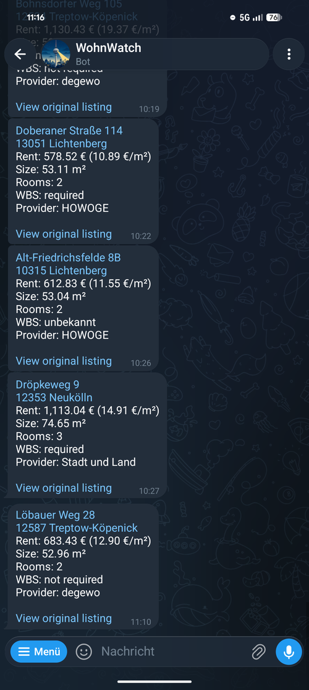
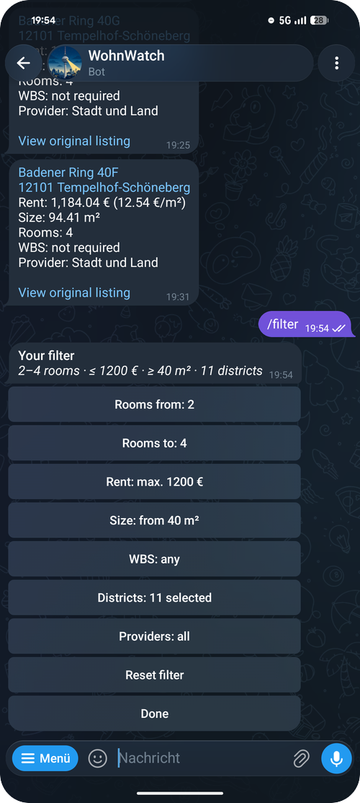
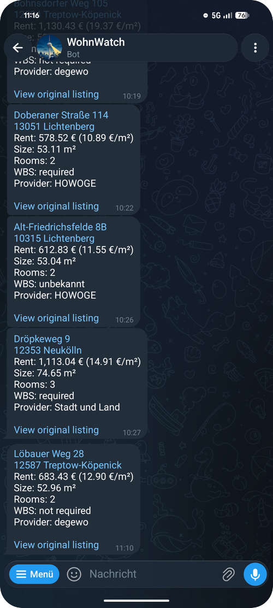

<p align="center">
  
</p>

<h1 align="center">wohn-watch</h1>

<p align="center">
  A Telegram bot that sends new apartments from Berlin's state-owned housing associations straight to your phone.
</p>

<p align="center">
  
  &nbsp;
  
  &nbsp;
  
</p>

Affordable apartments in Berlin are often gone within minutes. wohn-watch checks
[inberlinwohnen.de](https://inberlinwohnen.de) around the clock and sends you every
new listing that matches your search, right in Telegram. It covers HOWOGE, degewo,
Gewobag, GESOBAU, Stadt und Land, WBM and berlinovo.

<p align="center">
  <a href="#install">Install</a> ·
  <a href="#commands">Commands</a> ·
  <a href="#filters">Filters</a> ·
  <a href="#license">License</a>
</p>

## Install

You need Docker and a bot token from [@BotFather](https://t.me/BotFather).

```bash
git clone https://github.com/EiSiMo/wohn-watch.git && cd wohn-watch
cp .env.example .env        # set TELEGRAM_BOT_TOKEN, everything else is optional
docker compose up -d --build
```

You don't need a domain or an open port, because the bot polls Telegram itself.
The SQLite database lives in the `wohnwatch_data` volume.

## Commands

| Command | Description |
|---|---|
| `/start` | Introduction and setup |
| [`/filter`](#filters) | Change your search |
| `/status` | Filter and stats |
| `/pause` | Pause notifications |
| `/resume` | Resume notifications |
| `/language` | Switch language (English/German) |
| `/problem` | Report a problem |
| `/stop` | Delete all data |
| `/help` | Overview of all commands |

### Filters

| Filter | Description |
|---|---|
| Rooms | Minimum and maximum, half rooms allowed |
| Rent | Maximum total rent in € |
| Size | Minimum size in m² |
| WBS | Any, only without or only with a WBS (housing permit) |
| Districts | Any selection of Berlin's 12 districts |
| Providers | Any selection of the housing associations |

## License

[MIT](LICENSE)
